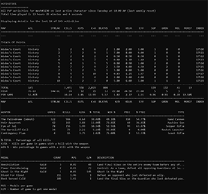

# dcli

dcli (Destiny Command Line Interface) is a collection of utilities and apps that provide a command line interface (CLI) for viewing player stats and data from Destiny 2, using the [Destiny 2 API](https://github.com/Bungie-net/api).

[](images/dcliah.png)
[](images/dcliad.png)

If you run into any issues, have any ideas, or just want to chat, please post in [issues](https://github.com/mikechambers/dcli/issues) or share on [Discord](https://discord.gg/2Y8bV2Mq3p)


## Apps

### Utilities
| TOOL | DESCRIPTION |
| --- | --- |
| [dclim](https://github.com/mikechambers/dcli/tree/main/src/dclim) | Manages and syncs the remote Destiny 2 API manifest database |
| [dclisync](https://github.com/mikechambers/dcli/tree/main/src/dclisync) | Downloads and syncs Destiny 2 Crucible activity history into a local sqlite3 database file |
| [dclitime](https://github.com/mikechambers/dcli/tree/main/src/dclitime) | Generates date / time stamps for Destiny 2 weekly event moments |


### Apps
| TOOL | DESCRIPTION |
| --- | --- |
| [dclia](https://github.com/mikechambers/dcli/tree/main/src/dclia) | Displays information on player's current activity within Destiny 2 |
| [dcliah](https://github.com/mikechambers/dcli/tree/main/src/dcliah) | Displays Destiny 2 activity history and stats |
| [dcliad](https://github.com/mikechambers/dcli/tree/main/src/dcliad) | Displays Destiny 2 Crucible activity / match details |


### Libraries
| TOOL | DESCRIPTION |
| --- | --- |
| [dcli](https://github.com/mikechambers/dcli/tree/main/src/dcli) | Library used across all of the dcli apps |

Each tool page contains additional tool specific information and usage examples.

You can also find some additional examples in the [examples](examples/) folder.

## Download and Installation

You can download the latest binaries for Windows, Linux and x86_64 Mac from the [releases](https://github.com/mikechambers/dcli-gha/releases/latest) page.

Just download, place them in your path and run from the command line (use --help to get a list of options). You can find a script [here](https://github.com/mikechambers/dcli/blob/main/tests/) that will run all of the apps to verfiy they are working and in your path.

[](https://github.com/mikechambers/dcli-gha/releases/latest)

**IMPORTANT**: Mac binaries are not signed, which can cause some hassle the first time you run them. You can find info on how to easily run them [here](https://github.com/mikechambers/dcli/wiki/Running-dcli-tools-on-Mac-OS-X).

## Getting Started

The core idea behind the project is to provide small, focused utilities that provide useful info by themselves, but that can also be combined together, or with other shell scripts to create greater functionality.

To get started, download the release (or compile from source), and place the executables somewhere within your path so you can call them from anywhere. Doing this will make it easy to call from anywhere on your system and from other sciprts.

If you are running on Mac, make sure to [read this article](https://github.com/mikechambers/dcli/wiki/Running-dcli-tools-on-Mac-OS-X) to ensure everything will run correctly.

Before viewing your stats you need to first sync the manifest (which contains information about weapons, maps, etc...).


### Download the manifest

You can download the latest Destiny 2 manifest database using dclim. This contains information about all of the items and activities in Destiny 2, and is updated periodically.

Just run:

```
$ dclim
```

and the manifest file will be downloaded and saved in a system appropriate directory. You should peridocially run this command to check whether the manifest has been updated by Bungie.

### Sync your activities

Next, lets sync all of our activity history to a local database. This data will be used by other apps, such as dcliah to generate and display stats.

```
$ dclisync --name mesh#3230
```

Replacing mesh#3230 with your own Bungie name.

You can find your Bungie name in game, or on Bungie's site at [https://www.bungie.net/7/en/User/Account/IdentitySettings](https://www.bungie.net/7/en/User/Account/IdentitySettings).

The first time you run this, it may take a couple of minutes to load all of your data (depending on the number of activities that you have). If any errors occur while syncing, just re-run the app when its done. It is smart enough to only sync the acitivties that it missed the first time.

Once you have done the initial sync, subsequent activity syncs should be very fast. You can periodically re-run the app to keep things in sync, or have dcliah / dcliad automatically sync before it displays your stats.

### Grabbing data

Lets see all of our Crucible stats since the weekly reset on Tuesday for our last played character:

```
$ dcliah --name mesh#3230 --moment weekly
```

Let's view our historic Crucible stats across all of our characters for all time:

```
$ dcliah --name mesh#3230 --mode all_pvp --moment all_time -class all
```

### Putting it all together

These can be useful on their own, but where they can be really powerful is when you start to customize them for how you want to use them.

There are a couple of examples in the [examples directory](https://github.com/mikechambers/dcli/tree/main/examples):

* Send a notification when you load into a new activity (particularly useful when playing crucible so you can see which map you are loading into)
* Automatically generate weekly reports on your Crucible stats and email them to yourself
* Track your Crucible stats per game play session

As you can see, right now, a lot of the functionality is Crucible based. If you would like to see other functionality, make sure you requests it in the [issues](https://github.com/mikechambers/dcli/issues), or [Discord](https://discord.gg/2Y8bV2Mq3p).

### Learning More

At anytime, you can see which arguments and options are avaliable by passing the *--help* argument:

```
$ dcliah --help
```

You can also find additional documentation and examples on the [individual app pages for each app](https://github.com/mikechambers/dcli).

## Questions, Feature Requests, Feedback

If you have any questions, feature requests, need help, or just want to chat, join the [dcli Discord server](https://discord.gg/2Y8bV2Mq3p).

You can also log bugs and features requests on the [issues page](https://github.com/mikechambers/dcli/issues).

## Compiling

Tools are written and compiled in [Rust](https://www.rust-lang.org/). The 1.50.0 rust version is required, which can be installed and set via:

```
$ rustup toolchain install 1.50.0
$ rustup override set 1.50.0
```


When compiling you must have an environment variable named `DESTINY_API_KEY` which contains your [Bungie API key](https://www.bungie.net/en/Application).

To compile, switch to the `src/` directory and run:

```
$ cargo build --release
```

which will place the compiled tools in *src/target/release*

## Known Issues

* Bungie names with certain characters will cause an error on first sync. More info [here](https://github.com/Bungie-net/api/issues/1528). Workaround is to manually add member entry in database.
* Tied matches are not displayed correctly, and are treated as a Victory.

## License

Project released under a [MIT License](LICENSE.md).

[](LICENSE.md)
